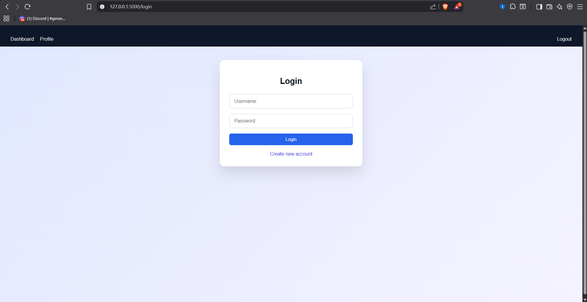
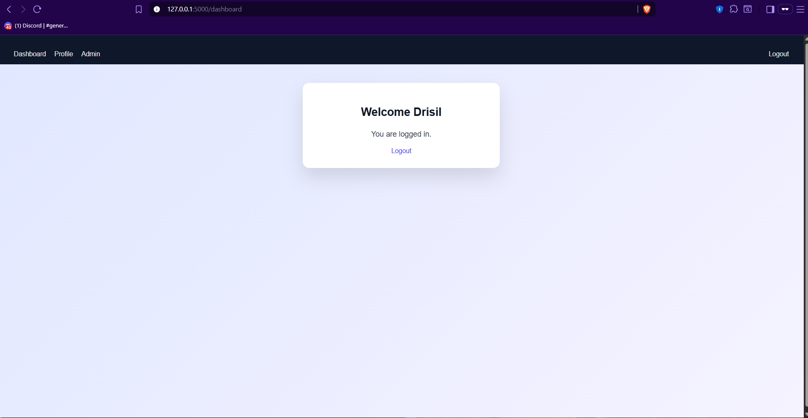
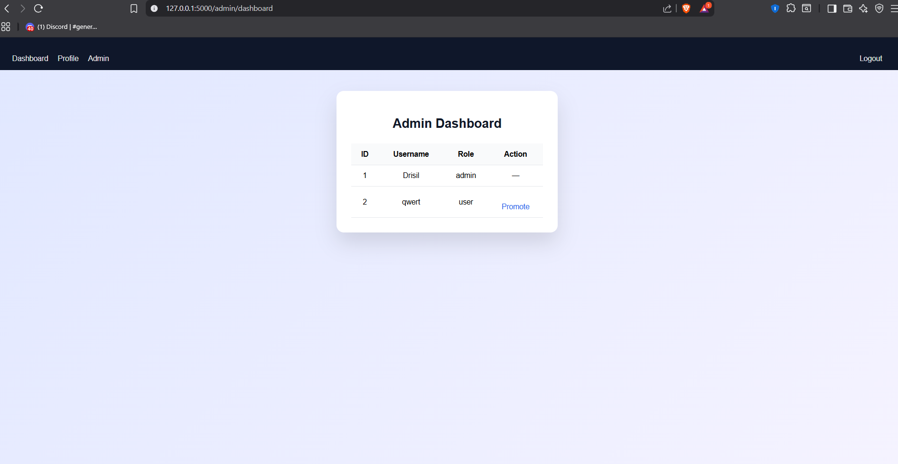

# Authentication System with Role-Based Access Control (Flask)

A Flask-based authentication system implementing secure user login, session management,
and role-based access control (RBAC). The application includes an admin dashboard for
managing users and enforcing server-side authorization rules.

This project focuses on clean backend architecture, security fundamentals, and
professional project structure suitable for portfolio and job interviews.

---

## Features

- User registration and login
- Secure password hashing
- Session-based authentication
- Role-based access control (User / Admin)
- Admin dashboard for managing users
- Protected routes using reusable decorators
- Clean UI with template inheritance
- Flash messages for user feedback

---

## Screenshots

### Login

### Dashboard

### Profile

### Admin Dashboard

---

## Tech Stack

- Python
- Flask
- SQLite
- HTML
- CSS

---

## Project Structure

auth_app/
├── app.py
├── README.md
├── .gitignore
├── templates/
│ ├── base.html
│ ├── login.html
│ ├── register.html
│ ├── dashboard.html
│ ├── profile.html
│ └── admin_dashboard.html
├── static/
│ └── style.css
└── screenshots/
├── login.png
├── dashboard.png
├── profile.png
└── admin-dashboard.png

---

## How to Run

1. Install dependencies:
   pip install flask

2. Run the application:
    python app.py

3. Open in browser:
    http://127.0.0.1:5000